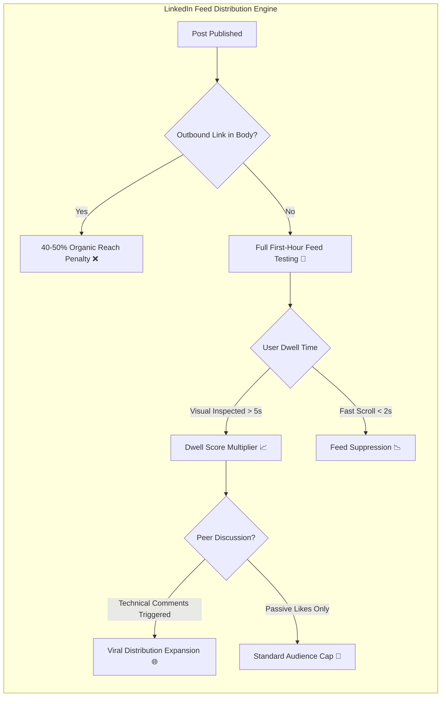
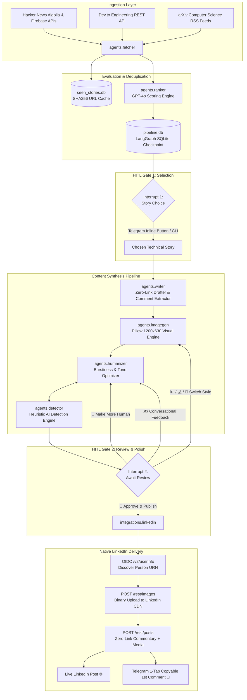

# 🚀 Autonomous AI News to LinkedIn Agentic Pipeline

[](https://www.python.org/downloads/)
[](https://github.com/langchain-ai/langgraph)
[](https://openai.com/)
[](https://www.anthropic.com/)
[](https://core.telegram.org/bots)
[](https://learn.microsoft.com/en-us/linkedin/)
[](https://www.docker.com/)
[](https://azure.microsoft.com/en-us/products/container-apps)
[](LICENSE)

An enterprise-grade, fully autonomous multi-agent content publishing system designed to curate high-signal artificial intelligence and systems engineering breakthroughs, eliminate algorithmic feed penalties, generate custom high-dwell visual cards, verify human authenticity via heuristic detection, and execute direct publishing to LinkedIn via its official REST API—with interactive Human-in-the-Loop (HITL) steering over Telegram.

---

## 📑 Comprehensive Table of Contents

1. [Executive Summary & Problem Statement](#-executive-summary--problem-statement)
2. [Algorithmic Engineering Strategy](#-algorithmic-engineering-strategy)
3. [End-to-End System Architecture](#-end-to-end-system-architecture)
4. [LangGraph State Machine & Checkpointing](#-langgraph-state-machine--checkpointing)
5. [Deep Dive: Multi-Agent Subsystems](#-deep-dive-multi-agent-subsystems)
   - [5.1 Multi-Source Topic Scanner (`agents.fetcher`)](#51-multi-source-topic-scanner-agentsfetcher)
   - [5.2 Technical Evaluation & Ranking Agent (`agents.ranker`)](#52-technical-evaluation--ranking-agent-agentsranker)
   - [5.3 Technical Drafter & Comment Extractor (`agents.writer`)](#53-technical-drafter--comment-extractor-agentswriter)
   - [5.4 Anti-AI Heuristic Detector (`agents.detector`)](#54-anti-ai-heuristic-detector-agentsdetector)
   - [5.5 Tone Humanizer & Feedback Loop (`agents.humanizer`)](#55-tone-humanizer--feedback-loop-agentshumanizer)
   - [5.6 High-Dwell Visual Engine (`agents.imagegen`)](#56-high-dwell-visual-engine-agentsimagegen)
   - [5.7 Unified Multi-Provider LLM Client (`agents.llm_client`)](#57-unified-multi-provider-llm-client-agentsllm_client)
6. [External Platform Integrations](#-external-platform-integrations)
   - [6.1 Direct Official LinkedIn REST API (`integrations.linkedin`)](#61-direct-official-linkedin-rest-api-integrationslinkedin)
   - [6.2 Interactive Telegram Bot Daemon (`integrations.telegram_bot`)](#62-interactive-telegram-bot-daemon-integrationstelegram_bot)
7. [Visual Generation Specification](#-visual-generation-specification)
8. [Data Layer & Persistence Schemas](#-data-layer--persistence-schemas)
9. [Project Directory Structure](#-project-directory-structure)
10. [Environment Configuration Reference](#-environment-configuration-reference)
11. [Installation & Local Setup](#-installation--local-setup)
12. [Operating Modes & CLI Usage](#-operating-modes--cli-usage)
13. [CI/CD & Cloud Deployment (Docker + Azure ACA)](#-cicd--cloud-deployment-docker--azure-aca)
14. [Troubleshooting & Gotchas](#-troubleshooting--gotchas)
15. [License & Acknowledgments](#-license--acknowledgments)

---

## 💡 Executive Summary & Problem Statement

Technical creators, founders, and engineering leaders who share architectural breakthroughs on LinkedIn face major algorithmic and workflow bottlenecks:

```
┌──────────────────────────────────────┬────────────────────────────────────────────────────────┐
│ Industry Pitfall                     │ How This Pipeline Solves It                            │
├──────────────────────────────────────┼────────────────────────────────────────────────────────┤
│ 1. Outbound Link Penalization        │ Zero links in post body. Links automatically extracted │
│    Feed reach drops by 40%–50% when  │ and published as a 1st comment immediately after post  │
│    raw URLs or preview cards appear. │ publication.                                           │
├──────────────────────────────────────┼────────────────────────────────────────────────────────┤
│ 2. Obvious AI "Slop" & Generic Tropes│ Deterministic heuristic detection analyzes burstiness, │
│    Formulaic intros ("In today's fast│ vocabulary perplexity, and strips 40+ banned phrases.  │
│    paced world...") kill engagement. │ Closed-loop feedback rewrites until AI score < 20%.    │
├──────────────────────────────────────┼────────────────────────────────────────────────────────┤
│ 3. Passive Summaries without Debate  │ Mandates a targeted, peer-level architectural CTA      │
│    Posts end with passive remarks    │ (trade-off question) to drive comments over passive    │
│    that fail to spark discussion.    │ likes, boosting viral feed distribution.               │
├──────────────────────────────────────┼────────────────────────────────────────────────────────┤
│ 4. Low Dwell-Time Media              │ Generates native dark-mode Architecture Infographics   │
│    Stock photos or empty text posts  │ or macOS Terminal Code Cards with benchmark badges.    │
│    are scrolled past in 0.5 seconds. │ Maximizes dwell time while readers inspect the card.   │
├──────────────────────────────────────┼────────────────────────────────────────────────────────┤
│ 5. Fragile Third-Party Gateways      │ Publishes directly through official LinkedIn REST API  │
│    Intermediary SaaS tools charge    │ (/rest/posts & /rest/images) with zero watermarks, no  │
│    monthly fees and add watermarks.  │ third-party branding, and zero monthly quotas.         │
└──────────────────────────────────────┴────────────────────────────────────────────────────────┘
```

---

## 🎯 Algorithmic Engineering Strategy

LinkedIn’s content distribution algorithm operates as a **dwell-time and engagement optimization engine**:



### The 3 Golden Rules Enforced by the Pipeline:

1. **Body Link Sanitization**: Outbound links are strictly stripped. The post ends with an arrow pointer (`👇 Check the source in the comments!`) and drops the source URL in the first comment.
2. **High Dwell-Time Native Visuals**: Every post is automatically paired with an asset rendered dynamically via Pillow:
   - **Terminal Code Card**: Highlights implementation syntax, terminal output, and a glowing benchmark badge (`⚡ p95 Latency: 14ms`).
   - **Architecture Infographic**: Formats 3 technical pillars into high-contrast card blocks on a `#0B0F19` dark canvas.
3. **Conversational Debate CTA**: Banned from writing generic conclusions (`"Bottom line: Redis is fast"`). Instead, drafts conclude with a technical prompt (`"Are you building custom token-aware caches or relying on native KV stores?"`).

---

## 🏗 End-to-End System Architecture



---

## 🔄 LangGraph State Machine & Checkpointing

The core pipeline is compiled as a stateful `StateGraph` in [`orchestrator.py`](file:///c:/Users/LENOVO/Desktop/Freelance/Projects/LinkedInPosts/orchestrator.py), using `SqliteSaver` to persist graph execution across process restarts.

### Graph State Definition (`PipelineState`)

```python
class PipelineState(TypedDict):
    run_date: str                        # Execution timestamp (ISO 8601)
    raw_news: list[dict]                 # Aggregated raw feed items
    ranked_top5: list[dict]              # Top 5 scored stories with rationale
    chosen_story: dict | None            # User-selected technical story
    draft_post: str | None               # Base technical draft
    humanized_post: str | None           # Refined post text (zero links)
    first_comment: str | None            # Source link packaged for 1st comment
    code_snippet: str | None             # Monospace code or YAML config
    benchmark_stat: str | None           # Performance statistic badge
    draft_image_path: str | None         # Local path to rendered PNG
    image_mode: str                      # 'card' | 'code' | 'ai'
    ai_detection_score: int | None       # Percentage (0-100) estimated AI probability
    review_status: str                   # 'pending' | 'edit_requested' | 'approved'
    edit_notes: str | None               # Human feedback notes for revisions
    linkedin_post_url: str | None        # Published LinkedIn post feed URL
    linkedin_comment_url: str | None     # Published comment URN
```

### Graph Execution Cycle

```
[START]
   ↓
(fetch_and_rank)
   ↓
<choose_story>  ───► [INTERRUPT 1: Pauses for User Story Selection]
   ↓ (Resume with chosen story)
(generate_and_render)
   ↓
(humanize) ◄─────────────────────────────────────────────┐
   ↓                                                      │
<await_review>  ───► [INTERRUPT 2: Pauses for Review]     │
   ↓ (Resume with user action)                            │
[route_review]                                            │
   ├── "edit" ────────────────────────────────────────────┘
   ├── "switch_image" ──► (regenerate_image) ──► <await_review>
   └── "approve" ──────► (publish) ────────────► [END]
```

---

## 🤖 Deep Dive: Multi-Agent Subsystems

### 5.1 Multi-Source Topic Scanner (`agents.fetcher`)

File: [`agents/fetcher.py`](file:///c:/Users/LENOVO/Desktop/Freelance/Projects/LinkedInPosts/agents/fetcher.py)

Ingests news from multiple developer networks, filtering by age (< 48 hours) and categorizing them into three priority tiers:

- **Priority 1: AI Developer Learning**: Scans for practical implementations: Model Context Protocol (MCP), Retrieval-Augmented Generation (RAG), local LLMs (Ollama, llama.cpp), agentic workflows, vLLM inference optimization, and structured outputs.
- **Priority 2: Developer Mistakes & Pitfalls**: Queries postmortems, architecture failures, memory leaks, security breaches, and anti-patterns.
- **Priority 3: Model Releases & Benchmarks**: Tracks official updates from DeepSeek, Anthropic, Mistral, OpenAI, and Meta.
- **Deduplication Engine**: Calculates `hashlib.sha256(url.encode()).hexdigest()` and checks against `data/seen_stories.db` to prevent repetitive content.

---

### 5.2 Technical Evaluation & Ranking Agent (`agents.ranker`)

File: [`agents/ranker.py`](file:///c:/Users/LENOVO/Desktop/Freelance/Projects/LinkedInPosts/agents/ranker.py)

Evaluates 50–70 raw items using OpenAI GPT-4o with structured JSON schema outputs:

- **Scoring Dimensions**:
  - **Developer Utility (40%)**: Does this provide actionable code, architecture patterns, or configuration?
  - **Novelty & Breakthrough Factor (30%)**: Is this a genuine paradigm shift or recycled marketing hype?
  - **Debate & Controversy Potential (30%)**: Does this challenge standard engineering assumptions to provoke comments?
- **Output Schema**: Returns a sorted list of top candidates with scores from 1.0 to 10.0 and clear rationale.

---

### 5.3 Technical Drafter & Comment Extractor (`agents.writer`)

File: [`agents/writer.py`](file:///c:/Users/LENOVO/Desktop/Freelance/Projects/LinkedInPosts/agents/writer.py)

Transforms the selected technical story into a high-signal LinkedIn post using structured generation:

- **Zero Body Links Enforcement**: Banned from including external links in the commentary.
- **First Comment Extraction**: Automatically parses the primary paper, GitHub repository, or documentation URL into a structured `first_comment` block.
- **Syntax & Benchmark Extraction**: Extracts a 4–10 line code block (`code_snippet`) and an empirical metric badge (`benchmark_stat`, e.g., `"⚡ 8.2x TTFT Reduction"`).
- **Conversational CTA**: Formulates an open-ended question targeted at peer engineers.

---

### 5.4 Anti-AI Heuristic Detector (`agents.detector`)

File: [`agents/detector.py`](file:///c:/Users/LENOVO/Desktop/Freelance/Projects/LinkedInPosts/agents/detector.py)

Performs deterministic heuristic analysis without relying on flaky third-party AI detector APIs:

1. **Sentence Burstiness (Length Variance)**: Human writers naturally alternate between short 3-word punches and complex 28-word thoughts. AI text clusters around 12–16 word sentences.
2. **Vocabulary Perplexity Proxy**: Measures technical jargon diversity against standard corporate stop words.
3. **Banned Trope Scanner**: Flags over 40 known LLM hallmarks:
   > _"delve"_, _"testament"_, _"tapestry"_, _"game-changer"_, _"groundbreaking"_, _"it's crucial to remember"_, _"revolutionize"_, _"seamless"_, _"at the end of the day"_, _"in conclusion"_.
4. **Scoring Scale**: Returns `% AI Score` (0% to 100%) and a status rating:
   - **`Pass 🟢`**: `< 25% AI`
   - **`Borderline 🟡`**: `25% - 40% AI`
   - **`Fail 🔴`**: `> 40% AI`

---

### 5.5 Tone Humanizer & Feedback Loop (`agents.humanizer`)

File: [`agents/humanizer.py`](file:///c:/Users/LENOVO/Desktop/Freelance/Projects/LinkedInPosts/agents/humanizer.py)

Refines raw drafts into natural developer commentary:

- Strips colon-heavy labels (`**Takeaway:**`, `**Analysis:**`).
- Enforces single/double-line paragraph rhythm to prevent wall-of-text fatigue.
- **Autonomous Self-Correction Loop (`rewrite_with_feedback_loop`)**:
  Iteratively rewrites the post and feeds it back into `detector.py` up to 3 times until the AI score drops below the 20% target threshold.
- **Regex URL Sanitizer (`strip_urls_from_text`)**: Regex post-processor that detects and strips any rogue markdown `[text](url)` or raw `https?://...` links from the body, pushing them to the first comment automatically.

---

### 5.6 High-Dwell Visual Engine (`agents.imagegen`)

File: [`agents/imagegen.py`](file:///c:/Users/LENOVO/Desktop/Freelance/Projects/LinkedInPosts/agents/imagegen.py)

Generates 1200×630px native visuals using Pillow (PIL) with anti-aliasing and custom typography:

- **Architecture Card**: Dark slate `#0B0F19` background, glowing cyan dot, pill tag, high-contrast headline, 3-pillar structured cards, and a distinct takeaway badge.
- **Terminal Code Card**: Dark canvas `#0D1117`, macOS window header with traffic-light buttons (`#FF5F56`, `#FFBD2E`, `#27C93F`), syntax-colored code (keywords, strings, comments), and an accent metric badge (`#00F0FF`).
- **AI Concept Blueprint**: Prompts OpenAI `gpt-image` models for 16:9 minimalist 3D isometric blueprints with fallback to Architecture Cards.

---

### 5.7 Unified Multi-Provider LLM Client (`agents.llm_client`)

File: [`agents/llm_client.py`](file:///c:/Users/LENOVO/Desktop/Freelance/Projects/LinkedInPosts/agents/llm_client.py)

Provides a clean interface for model execution:

- Supports both **OpenAI** (`gpt-4o`) and **Anthropic** (`claude-3-5-sonnet-20241022`) via `LLM_PROVIDER`.
- Enforces strict 15-second timeouts with connection pooling.
- Handles JSON parsing and markdown fence stripping (` ```json `).

---

## 🌐 External Platform Integrations

### 6.1 Direct Official LinkedIn REST API (`integrations.linkedin`)

File: [`integrations/linkedin.py`](file:///c:/Users/LENOVO/Desktop/Freelance/Projects/LinkedInPosts/integrations/linkedin.py)

Interacts directly with LinkedIn's official versioned REST API (`LinkedIn-Version: 202608`):

1. **Member URN Auto-Discovery**:
   - Calls OpenID Connect endpoint `GET https://api.linkedin.com/v2/userinfo` with the Bearer token.
   - Extracts the `sub` identifier to construct `urn:li:person:{sub}`.
   - Falls back to legacy `GET /v2/me` if required.
2. **Binary Image Upload (`POST /rest/images`)**:
   - Initializes upload with `action=initializeUpload` and `owner=person_urn`.
   - Uploads raw binary image bytes directly to LinkedIn's CDN `uploadUrl` via HTTP `PUT`.
   - Retrieves the permanent asset URN (`urn:li:image:...`).
3. **Post Creation (`POST /rest/posts`)**:
   - Submits clean commentary, visibility (`PUBLIC`), and distribution channel (`MAIN_FEED`).
   - Attaches the uploaded image URN.
4. **Unicode Mathematical Sans-Serif Bold**:
   - Translates markdown `**bold text**` into Unicode bold characters (e.g., `𝗕𝗿𝗲𝗮𝗸𝘁𝗵𝗿𝗼𝘂𝗴𝗵:` using code points `0x1D5D4`–`0x1D5EE`).
   - Renders native bold typography in LinkedIn feeds without external fonts.
5. **First Comment Tracking**:
   - Sets `LAST_COMMENT_STATUS = "pending_manual"` to deliver the 1-tap copyable comment block.

---

### 6.2 Interactive Telegram Bot Daemon (`integrations.telegram_bot`)

File: [`integrations/telegram_bot.py`](file:///c:/Users/LENOVO/Desktop/Freelance/Projects/LinkedInPosts/integrations/telegram_bot.py)

Asynchronous Telegram bot powered by `python-telegram-bot`:

```
┌─────────────────────────────────────────────────────────────┐
│ 📱 Telegram Interactive Review Flow                         │
├─────────────────────────────────────────────────────────────┤
│ 1. Scan Trigger:                                            │
│    • Automatic via APScheduler cron (09:00 UTC weekdays)    │
│    • Manual trigger via /scan command                       │
│                                                             │
│ 2. Story Selection Card:                                    │
│    • Sends Top 5 ranked stories with reasoning              │
│    • Inline keyboard: [ 1 ] [ 2 ] [ 3 ] [ 4 ] [ 5 ]         │
│                                                             │
│ 3. Review Card Message:                                     │
│    • Visual card photo uploaded directly                    │
│    • AI Detection badge: 🛡️ 15% AI · 85% Human (Pass 🟢)   │
│    • Formatted post preview                                 │
│    • 1st comment preview with source URL                    │
│                                                             │
│ 4. Interactive Action Buttons:                              │
│    • [ 📊 Architecture Card ] [ 💻 Code & Flow Card ]       │
│    • [ 🎨 AI Blueprint ]      [ 🧬 Make More Human ]        │
│    • [ 🚀 Approve & Publish ] [ ✍️ Edit Feedback ]         │
│                                                             │
│ 5. Post-Publication:                                        │
│    • Instant live LinkedIn URL                              │
│    • 1-Tap Copyable Monospace First Comment                 │
└─────────────────────────────────────────────────────────────┘
```

---

## 🎨 Visual Generation Specification

| Visual Style             | Aspect Ratio | Dimensions     | Canvas Tone             | Primary Accents                                           |
| :----------------------- | :----------- | :------------- | :---------------------- | :-------------------------------------------------------- |
| **Architecture Card**    | 16:9         | 1200 × 630 px  | `#0B0F19` (Deep Slate)  | `#00F0FF` (Cyan), `#6366F1` (Indigo), `#94A3B8` (Muted)   |
| **Terminal Code Card**   | 16:9         | 1200 × 630 px  | `#0D1117` (GitHub Dark) | `#FF5F56`, `#FFBD2E`, `#27C93F` (macOS Chrome), `#00F0FF` |
| **AI Concept Blueprint** | 16:9         | 1792 × 1024 px | Dark Grid Isometric     | Glowing Neon Wireframe Data Streams                       |

---

## 🗄 Data Layer & Persistence Schemas

### 1. `data/seen_stories.db` (Deduplication)

```sql
CREATE TABLE IF NOT EXISTS seen_stories (
    url_hash TEXT PRIMARY KEY,
    url TEXT NOT NULL,
    title TEXT NOT NULL,
    first_seen TIMESTAMP DEFAULT CURRENT_TIMESTAMP
);
```

### 2. `data/pipeline.db` (LangGraph SQLite Checkpoint)

Stores serialized thread checkpoints for interrupt state, allowing pipeline runs to pause for hours or days waiting for user review without losing memory:

- `checkpoints`: Serialized execution frames.
- `writes`: Node outputs and transition records.

---

## 📁 Project Directory Structure

```text
LinkedInPosts/
├── agents/                           # Multi-agent system modules
│   ├── __init__.py
│   ├── detector.py                   # Anti-AI heuristic engine (burstiness, perplexity)
│   ├── fetcher.py                    # Multi-source AI news & paper scanner
│   ├── humanizer.py                  # Tone refiner & self-correction feedback loop
│   ├── imagegen.py                   # Pillow visual card generator (card, code, AI)
│   ├── llm_client.py                 # Multi-provider client (OpenAI & Anthropic)
│   ├── ranker.py                     # Technical ranking agent (GPT-4o scoring)
│   └── writer.py                     # Zero-link technical drafter & comment creator
├── data/                             # Local runtime storage (gitignored)
│   ├── images/                       # Rendered 1200x630 visual card assets (.png)
│   ├── pipeline.db                   # SQLite LangGraph persistent state checkpoint
│   └── seen_stories.db               # SQLite deduplication storage
├── deploy/                           # Deployment manifests & helper scripts
├── frontend/                         # Web dashboard assets
├── integrations/                     # External platform integrations
│   ├── __init__.py
│   ├── linkedin.py                   # Official LinkedIn REST API client (v202608)
│   └── telegram_bot.py               # Interactive Telegram review bot daemon
├── .dockerignore                     # Docker build exclusion rules
├── .env                              # Local private environment configuration
├── .env.example                      # Environment variables template
├── .gitignore                        # Git ignore patterns
├── Dockerfile                        # Production multi-stage Docker container definition
├── main.py                           # Unified entrypoint (CLI mode & Telegram daemon)
├── orchestrator.py                   # LangGraph state machine & router definition
├── requirements.txt                  # Python dependencies
└── vercel.json                       # Vercel web frontend hosting configuration
```

---

## 🔐 Environment Configuration Reference

Create your `.env` file in the project root:

```ini
# =======================================================
# AI News -> LinkedIn Autonomous Pipeline (.env)
# =======================================================

# 1. LLM Provider ("openai" or "anthropic")
LLM_PROVIDER=openai

# 2. OpenAI Configuration
OPENAI_API_KEY=sk-proj-your_openai_api_key_here
OPENAI_MODEL=gpt-4o

# 3. Anthropic Configuration (Optional fallback/alternative)
ANTHROPIC_API_KEY=your_anthropic_api_key_here
ANTHROPIC_MODEL=claude-3-5-sonnet-20241022

# 4. Telegram Bot Configuration
TELEGRAM_BOT_TOKEN=123456789:AAExampleBotToken
TELEGRAM_ALLOWED_CHAT_ID=123456789

# 5. LinkedIn Publishing Mode
# Set to 'true' for local testing (simulates posts without modifying LinkedIn)
# Set to 'false' for live production publishing
DRY_RUN=false

# 6. Official LinkedIn REST API Credentials
# Token requires 'w_member_social' scope from LinkedIn Developer Portal
LINKEDIN_ACCESS_TOKEN=AQVUY...your_oauth_token_here
# Optional: Person URN is auto-detected via OIDC /v2/userinfo if omitted
# LINKEDIN_PERSON_URN=urn:li:person:zOe9XQlcIK

# 7. Pipeline & Scheduling
PIPELINE_SCHEDULE_CRON=0 9 * * 1-5
DATA_DIR=data
```

---

## 🛠 Installation & Local Setup

### 1. Prerequisites

- **Python**: `3.11` or higher
- **LinkedIn Developer Account**: Create an app at [LinkedIn Developers](https://www.linkedin.com/developers/) and add the **Share on LinkedIn** product (`w_member_social` scope).
- **Telegram Bot**: Message [@BotFather](https://t.me/botfather) to create a bot and get your token. Get your numerical Chat ID via [@userinfobot](https://t.me/userinfobot).

### 2. Environment Setup

```bash
# Clone the repository
git clone git@github.com:avpansmw-2005/linkedin_Post_Generator.git
cd linkedin_Post_Generator

# Create and activate virtual environment
python -m venv .venv

# On Windows:
.venv\Scripts\activate

# On macOS/Linux:
source .venv/bin/activate

# Install production dependencies
pip install -r requirements.txt
```

---

## 💻 Operating Modes & CLI Usage

### Mode 1: Telegram Bot Daemon (Production Default)

Runs the continuous background polling daemon with integrated `APScheduler` cron jobs:

```bash
python main.py
```

- Automatically executes the pipeline on weekdays at 09:00 UTC.
- Responds to the `/scan` command in your authorized Telegram chat.

### Mode 2: Direct CLI Execution (Manual Run)

Executes a single end-to-end pass inside your terminal without starting the Telegram bot:

```bash
python main.py --run-once
```

1. Scans feeds and displays top 5 ranked stories.
2. Prompts you to pick story #1–5.
3. Generates draft, card, and humanized post.
4. Prompts you to approve or input revision notes before publishing.

### Mode 3: Safe Dry-Run Simulation

Simulates the entire pipeline safely without modifying your real LinkedIn account:

```bash
python main.py --run-once --dry-run
```

- Generates mock URLs (`https://www.linkedin.com/feed/update/urn:li:activity:dryrun_...`).
- Validates state machine flow, image rendering, and comment formatting.

---

## 🚢 CI/CD & Cloud Deployment (Docker + Azure ACA)

The project includes an enterprise multi-stage [`Dockerfile`](file:///c:/Users/LENOVO/Desktop/Freelance/Projects/LinkedInPosts/Dockerfile) and automated GitHub Actions workflow [`.github/workflows/deploy.yml`](file:///c:/Users/LENOVO/Desktop/Freelance/Projects/LinkedInPosts/.github/workflows/deploy.yml).

### Automated GitHub Actions Workflow

Whenever code is pushed to the `main` branch:

1. Builds a lightweight Debian-based container image.
2. Pushes the image to Docker Hub (`avneetpandey82/linkedin-bot:latest`).
3. Authenticates with Microsoft Azure using service principal credentials.
4. Performs a zero-downtime rolling update on Azure Container Apps (`linkedin-post` in resource group `linkedin-post-alert`).

### Manual Docker Build & Run

```bash
# Build image
docker build -t linkedin-bot:latest .

# Run container in background with persistent volume for SQLite state
docker run -d \
  --name linkedin-bot \
  --restart unless-stopped \
  --env-file .env \
  -v $(pwd)/data:/app/data \
  linkedin-bot:latest
```

---

## 🔧 Troubleshooting & Gotchas

### 1. LinkedIn Comment API Permissions (`403 ACCESS_DENIED`)

- **The Cause**: Calling official LinkedIn REST `POST /rest/socialActions/{urn}/comments` with a self-serve developer token returns `403 ACCESS_DENIED` (`partnerApiSocialActions.CREATE`). LinkedIn moved automated member commenting under the **Community Management API** (`w_member_social_feed`), which requires formal partner application review.
- **The Pipeline Solution**: The post publishes cleanly via official REST API, and Telegram/CLI outputs the 1-tap copyable comment block. You tap to copy and drop it in 3 seconds, keeping your posts 100% native with zero third-party branding.

### 2. LinkedIn Token Expiry

- Self-serve LinkedIn OAuth access tokens expire after **60 days**.
- To refresh: Re-authenticate via the OAuth flow, retrieve the new token, and update `LINKEDIN_ACCESS_TOKEN` in your `.env` or Azure Container App secret store.

### 3. Telegram `Unauthorized` Error

- Verify that `TELEGRAM_BOT_TOKEN` has no leading or trailing whitespace.
- Ensure `TELEGRAM_ALLOWED_CHAT_ID` matches your exact numerical ID from [@userinfobot](https://t.me/userinfobot).

---

## 📄 License & Acknowledgments

Distributed under the **MIT License**.

Engineered with [LangGraph](https://github.com/langchain-ai/langgraph), [OpenAI](https://openai.com/), [Anthropic](https://anthropic.com/), [Pillow](https://python-pillow.org/), and the [LinkedIn REST API](https://learn.microsoft.com/en-us/linkedin/).
